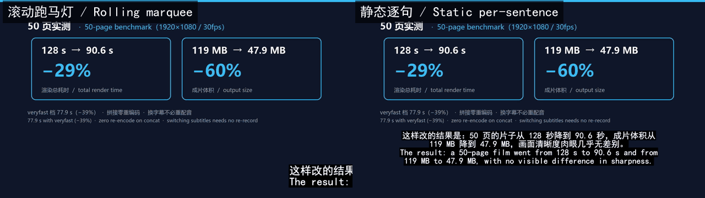

<div align="center">


# agent-skills

**Turn a PPT into a narrated explainer video — with AI voice-over and burned-in subtitles, rendered entirely by your local ffmpeg. Your slides never leave your machine.**

[](LICENSE)
[](skills/)
[](https://agentskills.io/specification)
[](#contributing)

</div>

---


> ↑ A 3-page sample generated by this skill itself (8 seconds, real speed): slide image + AI narration + rolling marquee subtitle.

## What this is

A collection of handcrafted **Agent Skills**. Each skill is a self-contained directory: a `SKILL.md` written for the agent (trigger conditions, pipeline steps, parameter reference, pitfall list) plus reusable `scripts/`.

These are not prompt templates. Each one freezes a **real, measured workflow** into an executable pipeline — including benchmark numbers, failure modes and their fixes — so the agent gets it right the first time.

## Skills

| Skill | What it does | Version | Status |
|---|---|---|---|
| [`ppt-to-explainer-video-ffmpeg`](skills/ppt-to-explainer-video-ffmpeg/) | Turns a PPT/PDF into a page-by-page explainer video with AI narration and burned-in subtitles, using local ffmpeg | v1.1.0 | stable |

<!-- To add a skill: create skills/<name>/ and add a row here. CI validates the frontmatter. -->

---

## The flagship skill: `ppt-to-explainer-video-ffmpeg`

### The problem it solves

You have a deck, and you need a video where **something explains each page out loud**, with subtitles burned into the picture.

The usual routes are uploading your material to a web service, or hand-syncing everything in a video editor. This skill takes a third route:

- **Everything renders locally.** ffmpeg runs on your machine; your slides are never uploaded. It works on an intranet too (only the TTS synthesis step needs network).
- **Narration and subtitles are in sync by construction.** A single TTS stream yields both the audio and the `SentenceBoundary` events, so nothing has to be force-aligned afterwards.
- **Changing subtitles does not mean re-recording.** The concat step produces a subtitle-free master, so switching subtitle style or adding an intro only costs one re-burn.

You trigger it in plain language: *"turn this deck into a narrated video"*, *"make a video of these slides with a voice-over"*.

### Architecture: three stages

The old approach baked subtitles into each segment and then chained N−1 levels of `xfade`. On 50 pages that measured **65 s + 63 s = 128 s**, and every added `xfade` level re-encoded the whole film, degrading quality generation after generation.

The new approach decouples **subtitle burn-in** from **transition assembly**:

```
① render segments in parallel (no subtitles, -j 4)  →  seg/NN.mp4 + durations2.txt
② concat with -c copy (hard cut)                    →  master.mp4  (zero re-encode, subtitle-free master)
③ burn all.ass once                                 →  final.mp4   (the only full-film re-encode)
```

### Benchmarks (50 pages, 1920×1080, 30 fps)

| Stage | v1.0.0 | v1.1.0 |
|---|---|---|
| Segment rendering | 65 s (serial, subtitles baked in) | **41.7 s** (parallel, `--j 4`) |
| Transition assembly | 63 s (49-level `xfade`, re-encodes the whole film each level) | **1.4 s** (hard cut, zero re-encode) |
| Subtitle burn | inside segment rendering | one pass over the film: 47.5 s / 34.8 s (`veryfast`) |
| **Total** | **128 s** | **90.6 s (−29%)**, **77.9 s with `veryfast` (−39%)** |

Full-film regression: size went from **119.5 MB to 47.9 MB** (40% of the old output), bitrate from 2059 to 778 kbps, with no visible difference in text sharpness on sampled frames.

> Parallelism is the single biggest win: with subtitles off, `--j 1` takes 58.8 s versus `--j 4` at 41.7 s (**−29%**).

### The three subtitle forms

| Form | Key settings | Use it for |
|---|---|---|
| **Static, per sentence** | `WrapStyle: 0`, one `Dialogue` per sentence boundary | Regular explainers, information-dense pages |
| **Rolling marquee** | `\q2` + `WrapStyle: 2` + `\move`, synced to each sentence | Demos where the subtitle should "travel with the voice" |
| **Portrait hard subtitles** | SimHei 62px, `Alignment=2`, `MarginV≈240` | 1080×1920 storyboards with their own bottom subtitle bar |



> ↑ Same page, same narration — only the subtitle form changes (left: rolling marquee; right: static per sentence). Switch with one flag on `gen_film_ass.py --mode`, and **switching does not re-record the voice-over or re-render the segments**.

⚠️ `\q1` **does not** mean "no wrapping" — for Chinese text without spaces, libass still wraps to the screen width. Rolling subtitles need `\q2` **and** header `WrapStyle: 2` as a belt-and-braces pair.

### Quick start

**1. Install the skill** (drop the skill directory into your agent runtime's skills directory)

```bash
git clone https://github.com/cernetman/agent-skills.git

# Claude Code (user level)
mkdir -p ~/.claude/skills
cp -r agent-skills/skills/ppt-to-explainer-video-ffmpeg ~/.claude/skills/

# Cursor
cp -r agent-skills/skills/ppt-to-explainer-video-ffmpeg ~/.cursor/skills/

# Any other runtime that supports Agent Skills: copy the skill directory into its skills directory
```

**2. Install dependencies and run the preflight check**

```bash
# ffmpeg + Python 3.10+ + edge-tts + a CJK font
pip install edge_tts

node "<SKILL_DIR>/scripts/precheck.mjs" --job "<JOBDIR>" --minutes 4
```

`precheck.mjs` tells you in one shot what is missing, and picks the Python interpreter that actually has `edge_tts` installed (having several interpreters is a common trap).

**3. Run the pipeline** (every step can be re-run on its own)

```bash
# ① Page images 01.png…NN.png into JOBDIR, one narration file per page in vo3/NN.txt

# ② Voice-over + sentence-level subtitles (one TTS stream yields both the mp3 and the boundaries)
python "<SKILL>/scripts/gen_sentence_ass.py" --job . --in vo3 --out mp3 \
    --assdir ass --bounds bounds_cache.json --mode scroll --size 60 --y 900

# ③ Per-page duration table (required input for render_all.py, never generated for you)
python -c "import json,glob,os,subprocess as sp;rows=[{'page':int(os.path.basename(p)[:2]),'dur':round(float(sp.run(['ffprobe','-v','error','-show_entries','format=duration','-of','default=nw=1:nk=1',p],capture_output=True,text=True).stdout.strip()),3)} for p in sorted(glob.glob('mp3/*.mp3'))];json.dump(rows,open('durations.json','w'),ensure_ascii=False,indent=1)"

# ④ Render segments in parallel, without subtitles
python "<SKILL>/scripts/render_all.py" --job . --seg seg --rows durations.json \
    --durations-out durations2.txt --no-sub --j 4 --crf 23 --preset veryfast --tail-freeze 3.0

# ⑤ Whole-film subtitle track on an absolute timeline (hard-cut films need --t 0)
python "<SKILL>/scripts/gen_film_ass.py" --job . --durations durations2.txt \
    --bounds bounds_cache.json --out all.ass --mode scroll --size 60 --y 900 --t 0

# ⑥ Assemble the film
node "<SKILL>/scripts/gen_final.mjs" --job . --mode concat --seg seg --ass all.ass --out final.mp4

# ⑦ Standalone SRT (sentence level, UTF-8 BOM)
node "<SKILL>/scripts/gen_srt.mjs" --job . --bounds bounds_cache.json --intro 2.5
```

Parameters, the timeline formula, fonts and aspect-ratio settings are all in [`SKILL.md`](skills/ppt-to-explainer-video-ffmpeg/SKILL.md).

### Requirements

| Dependency | Notes |
|---|---|
| **ffmpeg + ffprobe** | Required. Auto-detected on `PATH` and in common install locations; override with `--ff` / `--ffprobe` |
| **Python 3.10+** | Required. Needs `pip install edge_tts` (free Microsoft neural voices, no API key) |
| **A CJK font** | SimHei ships with Windows; `fonts-noto-cjk` on Linux; PingFang on macOS |
| **Network** | Only the TTS synthesis step needs it. Your material is never uploaded |

Per-platform install commands are in [`references/setup.md`](skills/ppt-to-explainer-video-ffmpeg/references/setup.md).

### Demo assets

The GIF at the top of this README was cut like this (you can use the same recipe for your own deck):

```bash
# Cut 8 seconds out of the film and squeeze it into a ~150 KB README GIF
ffmpeg -y -ss 10.5 -t 8 -i final.mp4 \
  -vf "fps=12,scale=960:-1:flags=lanczos,split[s0][s1];[s0]palettegen[p];[s1][p]paletteuse" \
  -loop 0 assets/demo.gif
```

Pick a clip that **contains a page transition and a subtitle mid-scroll** — that is what makes it obvious this is a page-by-page explainer whose subtitles follow the voice, rather than a static screenshot.

### The real asset is the pitfall list

The scripts are not hard to write. What is hard are the bugs that produce **wrong output without raising an error**. `SKILL.md` freezes 18 of them, measured in anger. A sample:

- **ASS timestamps wrote milliseconds into the centisecond field**: libass reads the fractional part as centiseconds, inflating it 10×. An event declared to start at 0.1 s only appeared at 1.0 s, with a 0–9 s error that jitters per event and never raises an error. Found and fixed while validating this repo end to end.
- **Cumulative subtitle drift**: a hard-cut film that forgets `--t 0` shifts subtitles 0.5 s earlier per page — 1.0 s by page 3, **24.5 s by page 50**, silently.
- **The first 9 pages lost their subtitles entirely**: the sentence-boundary cache may key pages as `"1"` or as `"01"`, and `cache.get("01")` returns nothing without complaining.

All 18, each with symptom, cause and fix, are in [`SKILL.md`](skills/ppt-to-explainer-video-ffmpeg/SKILL.md#pitfalls-in-the-order-they-bit-us).

### Known limits

- Speech synthesis needs network access (edge-tts). Your material is not uploaded.
- Original PPT animations are not preserved (each page is captured as a static image).
- Scans and image-only decks need OCR first.
- The documented word-rate heuristics are calibrated for Chinese narration; the pipeline itself is language-agnostic (voice and font are parameters).

---

## Repository layout

```
agent-skills/
├── skills/
│   └── ppt-to-explainer-video-ffmpeg/
│       ├── SKILL.md          # The skill itself: triggers, pipeline, parameters, pitfalls
│       ├── references/
│       │   └── setup.md      # Per-platform environment setup
│       └── scripts/          # 7 parameterized scripts (node + python)
├── tools/
│   ├── validate-skills.mjs   # Validates every SKILL.md frontmatter block
│   ├── check-links.py        # Checks relative links, anchors and frontmatter
│   └── pack_skill.py         # Builds a distributable ZIP, with a leak check
├── assets/icon.png
├── CHANGELOG.md
└── LICENSE
```

## Contributing

Issues and PRs are welcome. Please make sure these pass locally first:

```bash
node tools/validate-skills.mjs
python tools/check-links.py
python tools/pack_skill.py --skill ppt-to-explainer-video-ffmpeg --out dist --leak-check
```

New skills go in `skills/<skill-name>/`, and the `name` in `SKILL.md` must match the directory name — CI enforces this.

## License

[MIT](LICENSE) © 2026 cernetman
